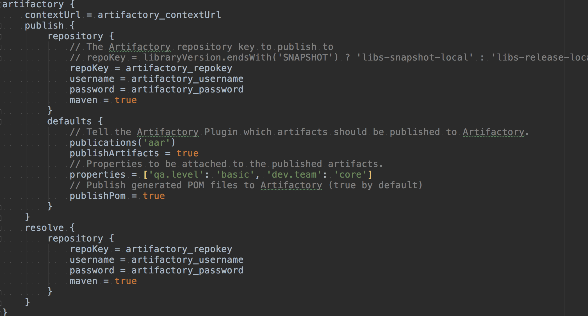

# Artifactory搭建本地maven仓库

## 一、Jfrog Artifactory简介
Jfrog Artifactory是一款二进制存储管理工具，用来管理构建工具(如：maven、gradle)等所依赖的二进制仓库，以方便管理第三方库和发布目标版本库，从而提高软件开发效率。它提供大量的插件以利于和不同工具之间的整合，内部使用权限管理更加安全，并支持高并发等等特性。

## 二、Artifactory的构建

搭建Artifactory私服的主要目的，是作为团队内所使用公共组件模块仓库。将Maven构件(jar和pom)存储到一个专门的Maven仓库，使用时通过Gradle选择版本，构建应用。

Artifactory软件下载地址：
 <https://bintray.com/jfrog/artifactory/jfrog-artifactory-oss-zip/6.21.0>

下载解压到本地，打开bin目录  执行启动命令
 > sh artifactory.sh

浏览器打开管理页面 
  <http://localhost:8081/artifactory/>

默认登陆账户 admin  密码 password

Artifactory 安装包里集成了tomcat，所以不需要再单独安装。默认的端口是8081，修改启动端口，可修改server.xml文件中的端口
> /tomcat/conf/server.xml

默认情况下Artifactory 是不允许匿名下载以及访问的，使用maven库时，拉取pom文件出现，
>    Received status code 401 from server: Unauthorized。

考虑到实际的情况，我们现在需要Artifactory 开启匿名访问权限。操作如下：
打开Artifactory后台，进入设置界面，
Administration -> Security -> Security onfiguration 
选中Allow Anonymous Access，然后点击保存。如下图

 
## 三、Artifatory 本地仓库创建
登陆到web服务台后，就可以创建相关的仓库了。仓库分为，本地Local型，远程Remote型，以及虚拟型。

* 本地私有仓库：用于内部使用，上传的组件不会向外部进行同步。
* 远程仓库：用于代理及缓存公共仓库，不能向此类型的仓库上传私有组件。 
* 虚拟仓库：不是真实在存储上的仓库，它用于组织本地仓库和远程仓库。

仓库创建可以在admin -> repository 下相应的子类型中，输入仓库名称，添加仓库描述，即可完成创建。

	
	

## 四、仓库文件上传
demo项目 <https://github.com/jics/artifactorydemo>

创建demo项目与相关library,配置相关文件，编译完成aar文件上传。

* 1、Project 中 gradle.properties 配置仓库地址与用户信息

    

* 2、 Project 中 build.gradle中添加配置

* 3、library Moudle中配置发布脚本  详见demo  

* 4、编译 library moudle并完成上传 
 > gradle assembleRelease artifactoryPublish

* 5、在Artifatory中查看发布的aar文件

## 五、gradle应用仓库文件
* 1、 Project 中 build.gradle中添加配置

* 2、app Moudle中 build.gradle中添加配置
 

* 3、编译工程，并验证。

## 六、第三方仓库引用注意点：
* 1、保持所使用仓库版本最新可如下配置 
     
 > implementation 'com.tencent.bugly:nativecrashreport:latest.integration'
         
latest.integration  resolves to latest snapshot or release, whichever is newer. There is no symbolic version for latest snapshot only (use 1.2.3-SNAPSHOT).

* 2、 maven缓存处理 ：
Normally, Gradle will still cache changing modules for a 24 hour period. You can configure this cache timeout using something like: 

>configurations.all {
                 resolutionStrategy.cacheChangingModulesFor 0, 'seconds'
                 resolutionStrategy.cacheDynamicVersionsFor 0, 'seconds'
                 }

 
## 七、扩展补充内容
- 1、https://blog.csdn.net/lu_xin_/article/details/51134849
- 2、 为什么选择 artifactory  https://jfrog.com/blog/artifactory-vs-nexus-integration-matrix/
- 3、https://yangbo.tech/2017/01/19/2017-01-19-distribute-android-library-to-local-jCenter/
- 4、http://blog.bugtags.com/2016/01/27/embrace-android-studio-maven-deploy/
- 5、http://blog.csdn.net/zhonggaorong/article/details/51601497
- 6、https://www.ibm.com/developerworks/cn/education/java/j-groovy/j-groovy.html
- 7、http://blog.csdn.net/zzulp/article/details/51385701
 

 
 

